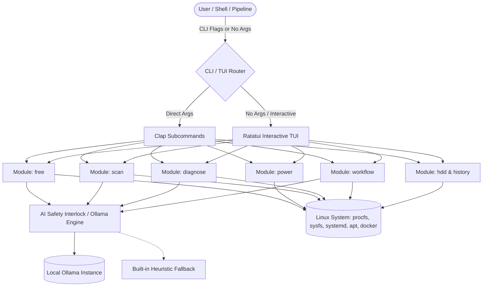

# Implementation Plan: `bioclean` — Agentic System Orchestrator

**Artifact:** `bioclean_upgrade_plan.md`  
**Branding:** AidBio AI  
**Authors:** Cleverson Matiolli, PhD and Gemini  
**Target Repository:** `/home/clever/aidbio/apps/clean-disk`  
**Binary Output:** `bioclean` (with `clean-disk` legacy alias)

---

## 1. Goal Description

Transform the existing bash/python `clean-disk` script into **`bioclean`**, a production-grade, agentic system orchestrator engineered in **Rust** for high-performance Linux bioinformatics and computational biology workstations.

`bioclean` operates on an **Observe $\rightarrow$ Analyze $\rightarrow$ Propose $\rightarrow$ Execute** pattern:

- Reclaims disk space and vacuums caches with AI-verified safety checks.
- Manages CPU governors, thermal limits, and energy/power profiles.
- Observes heavy disk hogs and active network sockets with local AI summaries.
- Generates comprehensive System Health Reports via local **Ollama** LLMs.
- Orchestrates multi-step agentic workflows (`prepare-crunch`, `maintenance`).
- Preserves full backward compatibility with `clean-disk`'s dataset migration (SRA, FASTQ, BAM, VCF) and transactional rollback history.



---

## 2. User Review Required

> [!IMPORTANT]
> **Rust Toolchain Installation:**  
> The target environment does not currently have `rustc` or `cargo` in `PATH`. The installer will install the official standalone Rust toolchain (`rustup`) for user `clever` at `~/.cargo/bin`, compile `bioclean` in release mode, and place the optimized binary in `~/.local/bin/bioclean`.

> [!NOTE]
> **Ollama Integration & Fallback:**  
> `ollama` is already running on `http://localhost:11434` with installed models (`qwen2.5-coder:7b`, `qwen3.5:4b`, `gemma4:e2b`, `qwen2.5:0.5b`). `bioclean` will auto-detect the best installed model (defaulting to `qwen2.5-coder:7b` or `qwen3.5:4b`), allow override via `--model <name>` or config file, and provide instant deterministic heuristic fallbacks if Ollama is unreachable.

> [!WARNING]
> **Legacy Compatibility:**  
> A symlink or wrapper `clean-disk -> bioclean` will be installed at `~/.local/bin/clean-disk` with argument mapping so all existing scripts calling `clean-disk -a`, `clean-disk -c`, `clean-disk -m`, etc., continue functioning seamlessly.

---

## 3. Command Hierarchy & Architecture Specification

### 3.1 Command Tree

| Module         | Action            | Description                                                                                                 | Key Flags                                                          |
|:-------------- |:----------------- |:----------------------------------------------------------------------------------------------------------- |:------------------------------------------------------------------ |
| **`free`**     | `cache`           | Cleans APT/Pacman, Pip, Conda/Mamba/Pixi, Docker layers, UV cache                                           | `--dry-run`, `-y, --yes`, `--all`                                  |
|                | `logs`            | Vacuums `journalctl` logs older than threshold                                                              | `--days <N>` (default 7), `--vacuum-size <size>`                   |
|                | `tmp`             | Safely cleans `/tmp` and `/var/tmp` respecting atime/mtime                                                  | `--min-age-hours <N>` (default 48), `--dry-run`                    |
|                | `orphans`         | Finds & removes unneeded packages (`apt autoremove`, `deborphan`)                                           | `--dry-run`, `-y, --yes`                                           |
|                | *(no args)*       | Launches Interactive TUI Checklist for space recovery                                                       |                                                                    |
| **`power`**    | `battery`         | Sets CPU governor to `powersave`, lowers scaling frequency, limits peripheral drain                         | `--governor powersave`, `--dry-run`                                |
|                | `performance`     | Sets CPU governor to `performance`, boosts I/O priority via `ionice`                                        | `--governor performance`, `--dry-run`                              |
|                | `thermal`         | Reads `/sys/class/thermal`, monitors `thermald`, analyzes T-junction limits                                 | `--json`, `--watch`                                                |
|                | *(no args)*       | Launches Interactive Power & Thermal Monitor TUI                                                            |                                                                    |
| **`scan`**     | `heavy`           | Parallel high-speed disk usage scanner + AI explanation of directory bloat                                  | `--path <dir>`, `--min-size <size>`, `--limit <N>`, `--ai-summary` |
|                | `sockets`         | Audits open sockets (`/proc/net`), identifies zombies, hung, or bandwidth hogs                              | `--listen-only`, `--zombies`, `--json`                             |
|                | *(no args)*       | Launches Interactive Visual Disk & Socket Explorer TUI                                                      |                                                                    |
| **`diagnose`** | *(root)*          | Gathers `dmesg`, `journalctl -p 3`, `df`, `free -m`, CPU/thermal metrics $\rightarrow$ Ollama health report | `--model <model>`, `--json`, `--output <file.md>`                  |
| **`workflow`** | `prepare-crunch`  | 5-step automated crunch readiness checklist (scan scratch, free caches, power perf, verify I/O, report)     | `--scratch <dir>`, `--dry-run`, `-y`                               |
|                | `maintenance`     | 4-step weekly maintenance (diagnose audit, clean caches/logs/orphans, fstrim SSD, report)                   | `--output <report.md>`, `--dry-run`, `-y`                          |
| **`hdd`**      | `scan`            | Lists external HDDs (`/media`, `/mnt`, `/run/media`) with total & free space                                | `--json`                                                           |
|                | `migrate`         | Interactively migrates SRA/FASTQ/BAM datasets to HDD + creates symlinks                                     | `--target-hdd <path>`, `--dry-run`, `-y`                           |
|                | `reconfigure-sra` | Reconfigures NCBI SRA Toolkit cache to HDD                                                                  | `--target-hdd <path>`                                              |
| **`history`**  | `list`            | Displays transaction log of migrations and operations                                                       | `--json`                                                           |
|                | `undo`            | Reverts the last migration session, restoring files and removing symlinks                                   | `--session-id <id>`, `-y`                                          |

---

## 4. Proposed Changes & File Layout

```
/home/clever/aidbio/apps/clean-disk/
├── Cargo.toml                     # Rust project manifest & dependencies
├── Cargo.lock
├── Makefile                       # Quick build, test, and install targets
├── install.sh                     # Upgraded installer (builds bioclean + links clean-disk)
├── README.md                      # Comprehensive bioclean documentation
├── prompts/
│   └── cleandisk-to-bioclean-upgrade.md
├── src/
│   ├── main.rs                    # Main entrypoint, CLI dispatcher & TUI trigger
│   ├── config.rs                  # Configuration loader (~/.config/bioclean/config.toml)
│   ├── cli/
│   │   ├── mod.rs                 # Clap CLI definitions & argument structures
│   │   ├── free_args.rs
│   │   ├── power_args.rs
│   │   ├── scan_args.rs
│   │   ├── diagnose_args.rs
│   │   ├── workflow_args.rs
│   │   └── hdd_args.rs
│   ├── ai/
│   │   ├── mod.rs
│   │   ├── client.rs              # Ollama API client (http://localhost:11434)
│   │   ├── prompts.rs             # Engineered prompt templates for diagnosis & safety
│   │   ├── safety_interlock.rs    # AI safety validation for destructive actions
│   │   └── fallback.rs            # Deterministic heuristic engine when Ollama is offline
│   ├── modules/
│   │   ├── mod.rs
│   │   ├── free.rs                # Cache, log, tmp, orphan reclamation engine
│   │   ├── power.rs               # CPU governors, thermald, thermal zones, ionice
│   │   ├── scan.rs                # Parallel disk scanner + socket auditor
│   │   ├── diagnose.rs            # System metrics harvester + LLM report generator
│   │   ├── workflows.rs           # Multi-step agentic workflows (prepare-crunch, maintenance)
│   │   ├── hdd.rs                 # External HDD discovery, dataset migration & SRA config
│   │   └── history.rs             # JSON session transaction logger and undo engine
│   ├── tui/
│   │   ├── mod.rs
│   │   ├── app.rs                 # Ratatui application state and event loop
│   │   ├── ui.rs                  # Layout, widgets, themes, and views
│   │   ├── menu_view.rs           # Main interactive hub
│   │   ├── free_view.rs           # Interactive cleaning checklist
│   │   ├── power_view.rs          # Interactive power/thermal governor switcher
│   │   └── scan_view.rs           # Interactive heavy file explorer
│   └── utils/
│       ├── mod.rs
│       ├── system.rs              # Command execution, sudo helpers, systemctl, journalctl
│       ├── procfs.rs              # /proc/net, /proc/cpuinfo, /sys/devices parser
│       ├── formatting.rs          # Byte formatting, colors, tables
│       └── transaction.rs         # Safe transactional file operations & symlinks
└── tests/
    ├── test_free.rs
    ├── test_power.rs
    ├── test_scan.rs
    ├── test_ai_fallback.rs
    └── test_history.rs
```

---

### Component 1: `Cargo.toml` Dependencies

```toml
[package]
name = "bioclean"
version = "2.0.0"
edition = "2021"
authors = ["Cleverson Matiolli, PhD", "Gemini"]
description = "Agentic System Orchestrator for High-Performance Linux Environments"

[dependencies]
clap = { version = "4.5", features = ["derive", "cargo", "env"] }
ratatui = "0.28"
crossterm = "0.28"
serde = { version = "1.0", features = ["derive"] }
serde_json = "1.0"
toml = "0.8"
reqwest = { version = "0.12", features = ["json", "blocking"] }
tokio = { version = "1.38", features = ["full"] }
colored = "2.1"
indicatif = { version = "0.17", features = ["rayon"] }
rayon = "1.10"
walkdir = "2.5"
sysinfo = "0.31"
chrono = { version = "0.4", features = ["serde"] }
anyhow = "1.0"
thiserror = "1.0"
tracing = "0.1"
tracing-subscriber = "0.3"

[dev-dependencies]
tempfile = "3.10"
```

---

### Component 2: AI Engine & Safety Interlock (`src/ai/`)

#### [NEW] `src/ai/client.rs`

Connects to local Ollama (`http://localhost:11434/api/generate` & `/api/tags`).

- Discovers available models (auto-selects `qwen2.5-coder:7b`, `qwen3.5:4b`, or configured fallback).
- Performs streaming or buffered inference with configurable timeout (e.g. 15s).
- Fallback gracefully to rule-based heuristics if Ollama is not responding.

#### [NEW] `src/ai/safety_interlock.rs`

Implements the blueprint safety requirement:

- Before executing destructive operations (e.g. purging large caches, removing environments, stopping services), generates risk assessment:
  *"I see you are about to delete /var/lib/conda/envs. This may break your current project 'Project_Alpha'. Do you wish to proceed? (y/N)"*
- Evaluates risk score (Low, Medium, High, Critical) based on target paths, project markers (`.git`, `Snakefile`, `nextflow.config`, `environment.yml`), and access times.

#### [NEW] `src/ai/prompts.rs` & `src/ai/fallback.rs`

- System Diagnosis Prompt: Summarizes `dmesg`, `journalctl -p 3`, `df -h`, `free -m`, thermal throttle events into an executive health overview with action items.
- Scan Heavy Summary Prompt: Classifies file extensions (`.sam`, `.bam`, `.fq.gz`, `.sra`, `.pth`, `.h5ad`) and summarizes workflow provenance.
- Rule-based fallback engine ensures 100% functionality even in air-gapped environments without Ollama.

---

### Component 3: CLI & Subcommands (`src/cli/` & `src/modules/`)

#### [NEW] `src/modules/free.rs`

Implements space reclamation:

- `cache`:
  - APT / Pacman: `apt-get clean`, `/var/cache/apt/archives`
  - Python / Pip: `pip cache purge`, `~/.cache/pip`
  - Conda / Mamba / Pixi: `conda clean -a -y` / `~/.conda/pkgs`
  - Docker: `docker system prune -f --volumes`
  - UV: `uv cache clean`
  - User caches: `~/.cache/thumbnails`, `~/.cache/Cypress`, browser caches
- `logs`:
  - `journalctl --vacuum-time=<N>d` or `journalctl --vacuum-size=<size>`
- `tmp`:
  - Safely inspects `/tmp` and `/var/tmp`, checking `atime` (last access time) and active process file descriptors to ensure no active process is disrupted.
- `orphans`:
  - `apt-get autoremove -y`, `deborphan` detection.
- `--dry-run`: Computes exact file lists and bytes reclaimable without making any deletions.

#### [NEW] `src/modules/power.rs`

Implements power and thermal management:

- `battery`:
  - Adjusts CPU governor to `powersave` via `/sys/devices/system/cpu/cpu*/cpufreq/scaling_governor`.
  - Configures energy performance preference (`energy_perf_bias` / `energy_performance_preference`) to `power` or `balance_power`.
- `performance`:
  - Sets CPU governor to `performance` across all cores.
  - Sets `energy_performance_preference` to `performance`.
  - Maximizes process I/O scheduling class (`ionice -c 1` or `-c 2 -n 0`).
- `thermal`:
  - Reads `/sys/class/thermal/thermal_zone*/temp`.
  - Inspects `thermald` status via `systemctl is-active thermald`.
  - Reports current temps, trip points, throttling events, and fan speeds.

#### [NEW] `src/modules/scan.rs`

Implements observability:

- `heavy`:
  - Rayon-powered multi-threaded directory traversal.
  - Detects heavy directories and categorizes bioinformatic formats (`.fastq`, `.bam`, `.sra`, `.vcf`, `.h5ad`, checkpoints, conda environments).
  - Feeds stats to Ollama or heuristic engine for contextual summaries.
- `sockets`:
  - Parses `/proc/net/tcp`, `/proc/net/udp`, `/proc/net/tcp6`, and matches against `/proc/[pid]/fd` to resolve process names, listening ports, established connections, zombie processes, and high network consumers.

#### [NEW] `src/modules/diagnose.rs`

- Harvester collects:
  - Kernel buffer: `dmesg -T -l err,warn` (last 50 lines).
  - Journal errors: `journalctl -p 3 -n 50 --no-pager`.
  - Filesystem: `df -h` and inode usage `df -i`.
  - Memory & Swap: `/proc/meminfo` and `free -m`.
  - Thermal & CPU: Load averages, CPU throttling counters (`/sys/devices/system/cpu/cpu*/thermal_throttle/`).
- Synthesizes all data into a prompt for Ollama $\rightarrow$ produces clean Markdown report.

#### [NEW] `src/modules/workflows.rs`

- `prepare-crunch`:
  
  1. Checks scratch disk space (e.g. `/home/clever/aidbio/ds` or custom target).
  
  2. Runs safe cache/log cleanup to free maximum headroom.
  
  3. Switches CPU profile to `performance` and verifies cooling margins.
  
  4. Audits active processes for competing high I/O consumers.
  
  5. Outputs a "Green Light" verification matrix.
- `maintenance`:
  
  1. Executes `diagnose` to check system stability and disk health.
  
  2. Executes `free cache`, `free logs`, and `free orphans`.
  
  3. Runs `fstrim -av` on SSD mounts.
  
  4. Writes a consolidated summary report in Markdown.

#### [NEW] `src/modules/hdd.rs` & `src/modules/history.rs`

- Full port and modernization of `clean-disk`'s HDD auto-discovery (`/media`, `/mnt`, `/run/media`), rsync data migration, transparent symlink creation, and NCBI SRA Toolkit cache configuration (`~/.ncbi/user-settings.mkfg`).
- Transaction session logging to `~/.aidbio/history/bioclean_sessions.json`.
- Single-command undo/rollback (`bioclean history undo`) to restore files and remove symlinks.

---

### Component 4: Interactive TUI (`src/tui/`)

Built with `ratatui` + `crossterm`:

- **Main Dashboard**: Quick status cards for Disk Space, CPU Governor, Thermal Zone Temps, Ollama Status, and navigation menu.
- **Interactive Space Recovery**: Interactive multi-select checkbox list of cleanup targets with estimated reclaimable space.
- **Power & Thermal Studio**: One-click switching between Battery, Balanced, and Performance governors with live temp gauge.
- **System Diagnostics View**: Streaming markdown viewer for Ollama health reports.

---

### Component 5: Build, Install & Backward Compatibility

#### [MODIFY] `install.sh`

- Detects if `cargo` is present; if not, offers/runs automatic `rustup` setup.
- Compiles `bioclean` in release mode (`cargo build --release`).
- Installs binary to `~/.local/bin/bioclean`.
- Creates backward-compatibility symlink `~/.local/bin/clean-disk -> ~/.local/bin/bioclean`.
- Configures shell `PATH` in `~/.bashrc`, `~/.zshrc`, `~/.profile`.

#### [MODIFY] `README.md`

- Updates documentation with full `bioclean` CLI syntax, TUI guide, Ollama setup, and workflow recipes.

---

## 5. Verification Plan

### Automated Tests

1. **Unit Tests (`cargo test`)**:
   
   - `test_ai_fallback`: Verify prompt rendering, heuristic fallback when Ollama is offline.
   
   - `test_free_dry_run`: Verify dry-run calculations on mock directory tree.
   
   - `test_procfs_parsing`: Verify thermal, memory, and socket parsing logic.
   
   - `test_history_transaction`: Verify JSON session serialization, record addition, and undo rollback simulation.
2. **Integration Tests**:
   
   - `cargo run -- --help`
   
   - `cargo run -- free --dry-run`
   
   - `cargo run -- power thermal`
   
   - `cargo run -- scan heavy --path ./ --min-size 1M`
   
   - `cargo run -- scan sockets`
   
   - `cargo run -- diagnose`

### Manual Verification

1. Launch `bioclean` without arguments to verify interactive Ratatui TUI navigation.
2. Run `bioclean workflow prepare-crunch --dry-run` and inspect the step-by-step readiness matrix.
3. Test legacy command: `clean-disk --help` and verify seamless backward compatibility.
4. Test Ollama connectivity: Run `bioclean diagnose` and verify the AI-generated System Health Report.

---

## 6. Execution Stages

1. **Stage 1 (Toolchain & Scaffolding):** Ensure Rust toolchain is ready, set up `Cargo.toml` and directory structure.
2. **Stage 2 (Core System Harvesters & AI Engine):** Implement procfs/sysfs readers, Ollama client, fallback heuristics, and safety interlock.
3. **Stage 3 (Modules Implementation):** Implement `free`, `power`, `scan`, `diagnose`, `workflow`, `hdd`, and `history`.
4. **Stage 4 (Clap CLI & Ratatui TUI):** Implement full CLI argument routing and the interactive TUI interface.
5. **Stage 5 (Packaging & Testing):** Update `install.sh`, `Makefile`, write unit tests, verify builds, and create walkthrough artifact.
